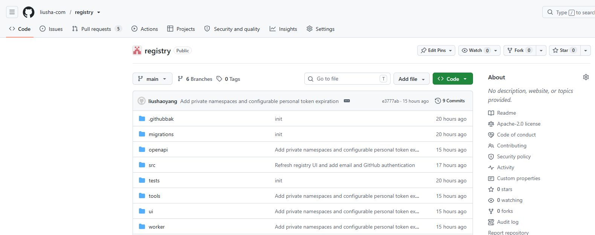
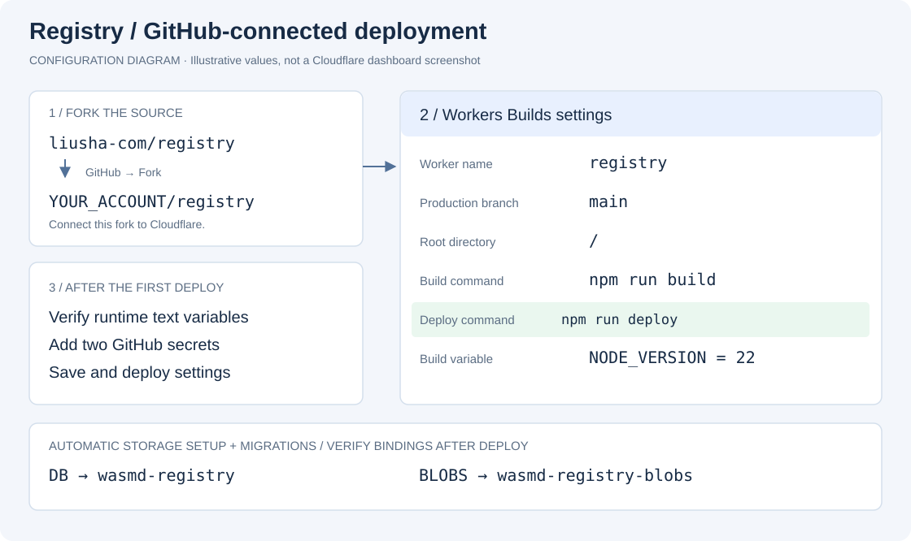
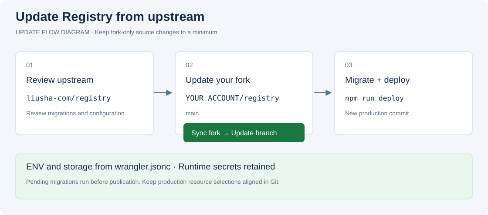

# Wasmd Registry

A self-hostable WebAssembly package registry built for **Cloudflare Workers**, with
**D1** for accounts and metadata and **private R2** storage for artifacts. Register
with email and password or GitHub, claim a namespace, and publish immutable modules
and components.

[](https://deploy.workers.cloudflare.com/?url=https%3A%2F%2Fgithub.com%2Fliusha-com%2Fregistry)

## Contents

- [Features](#features)
- [Deploy to Cloudflare Workers](#deploy-to-cloudflare-workers)
- [Deploy a GitHub fork with Workers Builds](#deploy-a-github-fork-with-workers-builds)
- [Update your fork from upstream](#update-your-fork-from-upstream)
- [Local development and manual deployment](#local-development-and-manual-deployment)
- [Configuration](#configuration)
- [Authentication](#authentication)
- [Publish and download packages](#publish-and-download-packages)
- [Storage, consistency, and backups](#storage-consistency-and-backups)
- [Monitoring and maintenance](#monitoring-and-maintenance)
- [Limits](#limits)
- [Architecture and interface](#architecture-and-interface)
- [Development and verification](#development-and-verification)
- [Project references](#project-references)

## Features

- Email/password and GitHub registration and login, Argon2id password hashing,
  HttpOnly sessions, CSRF protection, authentication throttling, and revocable tokens.
- Namespace ownership enforced for browser sessions and personal tokens.
- SHA-256 content-addressed artifacts and immutable semantic versions.
- Search, package/release pages, compatible-version resolution, and yank/unyank.
- Component interfaces, reconstructed WIT, worlds, imports, exports, and dependency graphs.
- Browser publishing, Wasmd CLI compatibility, and the standalone `wr` client.
- English multi-page UI and an embedded OpenAPI reference at `/openapi.yaml`.

## Deploy to Cloudflare Workers

Choose [Fork + Workers Builds](#deploy-a-github-fork-with-workers-builds) if you
want GitHub's **Sync fork** button for future updates.

Use the Deploy to Cloudflare button above to create your own repository and deployment.
You need a Workers Paid account, R2 enabled, and a GitHub OAuth App for GitHub
sign-in. Cloudflare creates a repository, provisions the resources in
`wrangler.jsonc`, and configures Workers Builds. Complete these settings on the
**Set up your application** page before selecting **Deploy**:

| Setup field | What to enter or select |
| --- | --- |
| Git account / Project name | Choose the destination Git account and the new Worker name. |
| Select D1 database (`DB`) | Select an existing Registry database, or **Create new** and enter a database name. |
| Select R2 bucket (`BLOBS`) | Select the matching existing Registry bucket, or **Create new** and enter a bucket name. |
| `GITHUB_CLIENT_ID` | Paste the Client ID from your GitHub OAuth App. |
| `GITHUB_CLIENT_SECRET` | Paste the client secret from that same OAuth App. |

The two GitHub secret fields are declared in [`.env.example`](.env.example), using
the same template mechanism as [Payload's Cloudflare D1 template](https://github.com/payloadcms/payload/tree/main/templates/with-cloudflare-d1).
Cloudflare reads the declaration and the field descriptions in `package.json` to
collect the values and configure Worker secrets during setup. The example contains
empty values; never replace them with real credentials in Git. No post-deployment
`wrangler secret put` commands are needed when both values are supplied here.

Before deploying, [create the GitHub OAuth App](#create-a-github-oauth-app) with
the final Worker origin as its Homepage URL and that origin plus
`/v1/auth/github/callback` as its callback URL. For example, Worker name `registry`
and account Workers subdomain `onebitbank` produce
`https://registry.onebitbank.workers.dev/v1/auth/github/callback`. If you change
the Worker name or use a custom domain, update the GitHub App URLs accordingly.
Cloudflare collects existing OAuth credentials; it does not create the GitHub
OAuth App for you.

When reusing storage, select an empty database or one already used by this registry,
and pair existing Registry metadata with its original artifact bucket. Pending
migrations run against the selected database; they do not import another app's
schema. New resources are created and bound automatically. Keep R2 private.

Use the **Deploy to Cloudflare** button to enter this template flow; a generic
**Import a repository** flow may not show these template fields. If Cloudflare
reports **Repository not found**, ensure the source repository is public and the
template changes, including `.env.example`, have been pushed to the branch used
by the button. Local changes cannot affect the hosted setup form.

Check the commands before deploying;
Cloudflare may default to `npx wrangler deploy`, which bypasses D1 migrations.
Set these commands explicitly:

| Setting | Value |
| --- | --- |
| Root directory | Repository root |
| Build command | `npm run build` |
| Deploy command | `npm run deploy` |

The source template intentionally omits `database_id`. `npm run deploy` builds
the application and runs `tools/deploy-worker.mjs` in this order:

1. If the one-click setup supplied a real `DB.database_id`, use it directly.
   Otherwise, look up `database_name` in the current Cloudflare account and create
   that D1 database if it does not exist. A later build reuses the same database.
2. Write a temporary deployment configuration containing the actual UUID, then
   run `wrangler d1 migrations apply DB --remote` with that configuration. Migrations
   create the application tables and record completed migrations in `d1_migrations`.
3. Check that every application table exists, then deploy the Worker using the same configuration and
   Wrangler's automatic resource provisioning for R2. Existing buckets are reused.

Database or migration failure stops publication. Database names customized in the
one-click setup are honored; migrations always reference the `DB` binding. The
temporary file is removed after the run and the source template is not overwritten
with a particular account's UUID. Do not put an all-zero UUID into the configuration:
Wrangler treats a nonempty ID as a configured resource, not a request to create one.

After deployment, open the generated HTTPS URL and register an account. There is
no first-user administrator elevation: each account can claim unowned namespaces,
and only the owner can publish or yank within that namespace. Create a personal
token under **Your account** to use the existing CLI.

## Deploy a GitHub fork with Workers Builds

Fork the repository, connect it to Cloudflare, and use **`npm run deploy`** as
Workers Builds' deploy command. It provisions or reuses D1/R2, applies pending D1
migrations, and publishes the Worker. After deployment, configure GitHub login
secrets and verify runtime variables and storage bindings in the dashboard.
Future code updates use GitHub's **Sync fork** button.

You can complete this flow in the browser. Workers Builds installs dependencies
and builds the Rust/Wasm helper; no local tools or GitHub Actions workflow are
required. Use a Cloudflare account with **Workers Paid** (required by the committed
`cpu_ms: 30000` setting) and **R2 enabled**.

The walkthrough follows the organization of the
[OpenList deployment guide](https://doc.oplist.org/ecosystem/official_worker/guide_cfw),
with Registry-specific configuration. The GitHub image is a real screenshot of
`liusha-com/registry`; the other figures are labeled configuration diagrams.
Dashboard labels may vary with language and Cloudflare UI updates.

### 1. Fork liusha-com/registry

1. Sign in to GitHub and open [liusha-com/registry](https://github.com/liusha-com/registry).
2. Click **Fork**, select your account or organization, and keep the repository
   name `registry`. Select **Copy the main branch only** if offered.
3. Click **Create fork**. Your repository should display
   **forked from liusha-com/registry** below its name.



`YOUR_ACCOUNT/registry` below means **your fork**. Cloudflare must connect to it.
Creating an empty repository, importing a copy, or using a template does not
establish the fork relationship needed by **Sync fork**.

A fork of this public repository is public too. D1/R2 data and private Registry
namespaces remain private. Store credentials in Cloudflare secrets, never in Git.
A private template-created repository such as `fengmao/registry-prod` does not
become a fork by adding an upstream Git remote. See
[GitHub's fork visibility rules](https://docs.github.com/en/pull-requests/reference/forks).

### 2. Connect your fork and deploy the Worker

1. Open [Cloudflare Workers & Pages](https://dash.cloudflare.com/?to=/:account/workers-and-pages)
   in the target account and select **Create application**.
2. Choose **Import a repository → Get started**, or **Continue with GitHub /
   Connect to GitHub**, depending on the dashboard version. Select a **Worker**.
3. Authorize Cloudflare's GitHub integration to access your fork, then select
   **`YOUR_ACCOUNT/registry`**. If it is missing, update the Cloudflare GitHub App's
   repository access. Organizations may require owner approval.
4. Enter the following settings, then select **Save and Deploy / Deploy**.

| Setting | Value |
| --- | --- |
| Worker/project name | `registry`, matching `name` in `wrangler.jsonc` |
| Repository | `YOUR_ACCOUNT/registry` |
| Production branch | `main` |
| Root directory | Repository root (`/` in the dashboard) |
| Build command | `npm run build` |
| Deploy command | **`npm run deploy`** |
| Build environment variable | `NODE_VERSION` = `22` |
| Builds for non-production branches | Disabled for this production setup |

Keep automatic dependency installation enabled. The npm lockfile pins the tools,
and the build script installs Rustup and its target when necessary. The deploy
command also invokes the build, reusing matching Wasm output within the build.



**Use `npm run deploy` for every build in this guide.** The command reads
`wrangler.jsonc`, resolves or creates D1, applies pending migrations, checks the
schema, then deploys with R2 provisioning. A migration failure stops publication.
Do not replace it with `npx wrangler deploy`, which skips the migration wrapper.

The Git import flow does not collect the one-click template's resource selectors
or OAuth secrets. With an unchanged fork, the deployment uses D1
`wasmd-registry` and R2 `wasmd-registry-blobs`. To use different resources, set
`database_name` (or the real `database_id`) and `bucket_name` in your fork's
`wrangler.jsonc` **before the first build**. Pair an existing Registry database
with its original artifact bucket. Independent instances need distinct storage.

For an **existing Worker**, connect the fork under **Settings → Builds → Connect**
and set the same commands there. Match its name, D1/R2 resources, and plaintext
settings in `wrangler.jsonc` before building. Keep credentials in Worker secrets.
Review automatic configuration PRs before merging them. See
[Cloudflare's Git integration guide](https://developers.cloudflare.com/workers/ci-cd/builds/).

### 3. Manually add runtime environment variables and secrets

After deployment, open **Workers & Pages → registry → Settings → Variables and
Secrets** (sometimes **Runtime variables and secrets**). Verify the following
**Text** values, which are supplied by `vars` in `wrangler.jsonc`. Add or adjust
values here if needed; enter them without surrounding quotes. For changes to
survive future builds, also update `vars` in your fork's `wrangler.jsonc`.
Dashboard-only plaintext changes can be overwritten by the next deployment.

| Type | Name | Initial value |
| --- | --- | --- |
| Text | `PUBLIC_READ` | `true` |
| Text | `REGISTRATION_ENABLED` | `true` |
| Text | `MAX_BLOB_BYTES` | `8388608` |
| Text | `MAX_ANALYSIS_BYTES` | `8388608` |

These enable anonymous access to public packages and registration, and set the
artifact upload/analysis limits to 8 MiB. See [Configuration](#configuration) for
details. Private namespaces still require their owner's authentication.

To enable **Continue with GitHub**, [create a GitHub OAuth App](#create-a-github-oauth-app)
and add the following entries using type **Secret** on the same Worker page:

| Type | Name | Value |
| --- | --- | --- |
| Secret | `GITHUB_CLIENT_ID` | Your GitHub OAuth App's Client ID |
| Secret | `GITHUB_CLIENT_SECRET` | The same OAuth App's generated client secret |

Set the OAuth App's **Homepage URL** to your deployed origin and its
**Authorization callback URL** to that origin plus `/v1/auth/github/callback`.
For example: `https://registry.YOUR_SUBDOMAIN.workers.dev/v1/auth/github/callback`.
Save and **Deploy** the settings when prompted. Email/password authentication
works without the two GitHub secrets once storage is initialized.

Add these values to the **Worker runtime**, not **Settings → Builds → Variables
and secrets**. Build settings are only available while compiling/deploying.
The GitHub connection for source access is separate from the OAuth App for user
login. `.env.example` documents secret names; it does not set production values.
See [Cloudflare runtime variables](https://developers.cloudflare.com/workers/configuration/environment-variables/)
and [runtime secrets](https://developers.cloudflare.com/workers/configuration/secrets/).

### 4. Verify D1 and R2, or manually correct bindings

A successful `npm run deploy` normally creates or reuses and binds these
resources automatically. Verify them under **Worker → Bindings**. If you need to
create resources yourself or correct a binding, use the dashboard steps below
and set the same resource names/IDs in `wrangler.jsonc` before redeploying.
The **binding names must be exactly `DB` and `BLOBS`**, including capitalization.
Dashboard-only binding changes can be replaced by the next build's configuration.

| Resource | Suggested resource name | Worker binding |
| --- | --- | --- |
| D1 database | `wasmd-registry` | `DB` |
| Private R2 bucket | `wasmd-registry-blobs` | `BLOBS` |

**D1 database:**

1. In the Cloudflare account, open **Storage & databases → D1 SQL Database**.
2. Select **Create database**, enter `wasmd-registry` (or another name), and finish
   creation. To reuse storage, choose an existing database belonging to Registry.
3. Return to **Workers & Pages → registry → Bindings → Add binding**.
4. Select **D1 database**, set the variable/binding name to **`DB`**, select that
   database, and click **Add binding**. Save/deploy changes if prompted.

**R2 bucket:**

1. Open **Storage & databases → R2 Object Storage** and enable R2 if required.
2. Select **Create bucket**, enter `wasmd-registry-blobs` (or another name), and
   create the bucket. You may instead select an existing Registry bucket.
3. Return to the Worker's **Bindings → Add binding**, select **R2 bucket**, set
   the variable/binding name to **`BLOBS`**, and choose the bucket.
4. Save/deploy the binding. Keep the bucket private; Registry serves authorized
   downloads through the Worker. No public bucket URL is needed.

When reusing a Registry database, select its original artifact bucket too. Each
independent Registry instance needs its own storage pair. Adding a binding alone
creates no application tables. After changing storage, update `wrangler.jsonc`
and retry the build with `npm run deploy` to apply migrations to the selected
D1 database. See Cloudflare's
[D1 dashboard setup](https://developers.cloudflare.com/d1/get-started/) and
[R2 bucket creation guide](https://developers.cloudflare.com/r2/buckets/create-buckets/).

### 5. Verify automatic database migrations

In **Worker → Deployments / Builds**, check that the deployment log shows
`d1 migrations apply` and schema checks before Worker publication. The command
runs SQL files from `worker/migrations` in order and records completed files in
`d1_migrations`. Later builds apply only pending files.

Open **D1 SQL Database → the database bound as DB → Console** and verify:

```sql
SELECT name FROM sqlite_master WHERE type = 'table' ORDER BY name;
SELECT name, applied_at FROM d1_migrations ORDER BY id;
SELECT email FROM users LIMIT 0;
SELECT visibility FROM namespaces LIMIT 0;
SELECT overview, overview_revision FROM packages LIMIT 0;
```

You should see tables including `users`, `namespaces`, `packages`, `versions`,
and `d1_migrations`; the column checks should succeed even before users register.

If tables are missing, verify that `wrangler.jsonc` selects the same D1 database
as the Worker's `DB` binding, then retry the build using `npm run deploy` and
inspect the migration log. If migration history and the existing schema disagree,
inspect the failed SQL before retrying; do not blindly replay completed
`ALTER TABLE` statements or mark failed migrations as complete. See
[repairing an empty D1 database](#repairing-an-existing-deployment-with-an-empty-d1-database).

### 6. Verify the deployment and optionally add a domain

1. In the Worker dashboard, verify the `DB` and `BLOBS` bindings, four runtime
   text variables, and both GitHub secrets if GitHub login is enabled.
2. Visit `https://YOUR_WORKER_HOST/readyz`; it should return a successful response
   after checking D1 and R2.
3. Open `/register`, register with email/password, create a namespace, publish a
   small Wasm file, and download it to verify the complete storage path.
4. For GitHub login, check `/v1/auth/providers` returns `"github": true`, then test
   **Continue with GitHub**. A callback error usually means the OAuth App URLs
   do not match the address in your browser.

Optionally add a domain under **Settings → Domains & Routes → Custom Domain**.
After it is active, update both OAuth App URLs to that origin. See
[Workers Custom Domains](https://developers.cloudflare.com/workers/configuration/routing/custom-domains/).

## Update your fork from upstream

Workers Builds runs **`npm run deploy`** after your fork's production branch
changes. Plaintext variables and D1/R2 bindings are deployed from
`wrangler.jsonc`; keep that file aligned with the intended production settings.
Runtime GitHub secrets stay on the same Worker across normal deployments.
Accounts, namespaces, overviews, and artifacts live in D1/R2, outside Git.

1. Review changes in [liusha-com/registry](https://github.com/liusha-com/registry),
   including new migrations and runtime settings. Back up existing data before
   a production update and follow any release-specific migration instructions.
2. Open **your fork → main → Sync fork → Update branch**. If GitHub reports
   conflicts, resolve them in the offered PR and preserve your Worker name,
   resource selections, and custom `vars` in `wrangler.jsonc`.
3. Cloudflare builds the updated `main` and runs `npm run deploy`. Pending D1
   migrations run before publication. Watch **Worker → Deployments / Builds**
   and verify the deployed commit matches the updated fork.
4. Add any newly required runtime secrets in the Worker dashboard. Verify the
   deployed variables and `DB`/`BLOBS` bindings, then check `/readyz`, login,
   and an existing package download.



If GitHub says the branch is up to date, there is nothing to sync. See
[GitHub's Sync fork guide](https://docs.github.com/en/pull-requests/how-tos/work-with-forks/syncing-a-fork).
Fork-specific source/configuration edits can still cause merge conflicts.

Using the same Worker and configured resources does not clear storage. Changing
a binding may point the site at different data without deleting the old resource.
A code rollback does not undo SQL migrations.

**Moving from a template-created repository:** create a real GitHub fork, record
the existing Worker's name, plaintext variables, D1 name/ID, and R2 bucket, and
set those values in the fork's `wrangler.jsonc` before connecting the existing
Worker to it. Use `npm run deploy` as the deploy command and keep the existing
Worker secrets. Reconnecting Git does not move data. A public fork cannot replace
a private repository's visibility requirements.

### Troubleshooting GitHub-connected deployments

| Symptom | Check |
| --- | --- |
| Fork missing from repository picker | Grant the Cloudflare GitHub App access to the fork and select the correct account/organization. |
| Worker name mismatch | Dashboard Worker name and `wrangler.jsonc` `name` must match. |
| Build fails | Confirm the deploy command is `npm run deploy` and inspect the first failing step in the build log. |
| Registration reports storage unavailable | Verify `DB` and `BLOBS` match `wrangler.jsonc`, and check migration logs. |
| D1 exists but has no tables | Retry the build with `npm run deploy`; check that migrations target the same database as the Worker's `DB` binding. |
| R2 missing from binding picker | Enable R2 and create/select a bucket in the same Cloudflare account. |
| ENV or bindings change after an update | Update `vars`, D1 selection, and R2 selection in `wrangler.jsonc`; dashboard-only changes are not durable across builds. |
| GitHub sign-in is missing | Add both OAuth values as **Worker runtime secrets**, save/deploy, and check `/v1/auth/providers`. Build secrets alone do not enable login. |
| Duplicate column during migration | Inspect the schema and migration history before retrying; the SQL may already have run. |
| Sync fork is missing | Verify **forked from liusha-com/registry** appears on the repository. Template copies are independent repositories. |
| Sync succeeds but site is unchanged | Check production branch `main`, automatic builds, watch paths, build errors, and deployed commit. |

## Local development and manual deployment

Install Node.js 22+ and Rustup. `npm ci` installs the pinned Wrangler, Wasm build
tool and test runtime. The build script uses Rust 1.98.0 and installs its
`wasm32-unknown-unknown` target. On Linux/macOS it can bootstrap Rustup from the
official installer; Windows users should install Rustup first. To use an already
installed compatible toolchain, set `REGISTRY_RUST_TOOLCHAIN` (for example, `stable`).

```sh
npm ci
npm run dev
```

This builds the Wasm helper, applies local migrations and starts Wrangler on
`http://localhost:8787`. Local persistence is under `.wrangler/state`, separate
from all remote data. No Cloudflare login is needed for local development or tests.

For a manual remote deployment:

```sh
npx wrangler login
npm run deploy
```

The deploy command creates missing resources automatically. To use an existing
database, set its real `database_id` in `wrangler.jsonc`, or set `database_name`
to its exact name. Use `bucket_name` to select an existing R2 bucket. Choose distinct
resource names when hosting independent registries in one Cloudflare account.

The same command applies new migrations on later deployments. A migration failure
stops deployment. Do not use `wrangler versions upload` against production bindings
for untrusted pull requests; use separate preview resources for integration tests.

### Repairing an existing deployment with an empty D1 database

If registration reports `Registry storage or processing is unavailable.` and D1
has no application tables, creating or binding the database alone is insufficient.
Verify that `wrangler.jsonc` selects the database bound to the Worker, set the
Workers Builds deploy command to `npm run deploy`, and retry the production
build. The log must show `d1 migrations apply` before Worker publication.

To apply migrations from an authenticated local checkout without building or
publishing the Worker, verify that `database_name` (or `database_id`) selects the
deployed database and run:

```sh
npx wrangler login
node tools/deploy-worker.mjs --migrate-only
```

This uses the same database resolution and migration checks as deployment.
It preserves existing data and records applied migrations in `d1_migrations`.
Afterwards D1 should contain the application tables (including OAuth tables) and `d1_migrations`;
`/readyz` should return success after checking both D1 and R2.

## Configuration

See [email and GitHub authentication](#authentication) for OAuth App setup,
required secrets, callback URLs and compatibility with existing accounts.

Edit `vars` in `wrangler.jsonc` and redeploy with `npm run deploy`. Boolean
settings are strings. Dashboard-only changes to plaintext variables may be
overwritten on the next build. Store GitHub OAuth credentials as Worker secrets;
normal code deployments preserve those secrets.

| Variable | Default | Meaning |
| --- | --- | --- |
| `PUBLIC_READ` | `"true"` | Anonymous registry API and artifact reads. Set `"false"` to require a session or personal token. Public HTML/assets remain available for signing in. |
| `REGISTRATION_ENABLED` | `"true"` | Set `"false"` after creating accounts to close registration. |
| `MAX_BLOB_BYTES` | `"8388608"` | Upload limit, at most 8 MiB in this profile. Enforced while reading even without Content-Length. |
| `MAX_ANALYSIS_BYTES` | `"8388608"` | Automatic WIT inspection limit, at most 8 MiB. Larger files can still be published and downloaded within the upload limit. |

The request URL determines the allowed browser origin and secure-cookie policy,
so custom domains need no hard-coded public URL. Sessions last 24 hours; personal
tokens default to 90 days and can have a custom duration or no expiration. Only hashes of credentials are stored. Sessions are
cookie-only, personal tokens are bearer-only, and session mutations require a
CSRF token. Passwords use Argon2id (19 MiB memory, two iterations, one lane).
D1 persists per-user and per-IP authentication throttling. An hourly scheduled
handler removes expired credentials and throttle records.

The release page displays **Component interfaces**, including imports, exports,
and reconstructed WIT. Older deployments only analyzed files up to 1 MiB. With
`MAX_ANALYSIS_BYTES=8388608`, existing components missing metadata are analyzed
from R2 on their first `/component` request and cached in D1, so existing releases
do not need to be republished. Core modules and undecodable components have no
inspectable WIT; files above a customized analysis limit report that limit explicitly.

All R2 access goes through the Worker. Keep the bucket private: do not enable
`r2.dev` or attach a public bucket domain. Artifact downloads use attachment and
sandbox headers regardless of uploaded media type. Switching an existing public
registry to private does not revoke copies or responses previously cached by
clients; use a new private deployment if that is required.

## Authentication

### Email and password

Registration requires an email address and a password of at least 12 characters,
with a maximum of 128 UTF-8 bytes. Email addresses are trimmed and lowercased.
The registration and login APIs accept `email` and `password`; supplying `username`
returns HTTP 400. There is no username login fallback.

The database retains `username` as a stable internal identifier for sessions,
tokens, and namespace ownership. New email accounts receive a generated identifier
that does not expose the email address as the namespace owner. GitHub accounts use
GitHub's numeric user ID, so renaming a GitHub account does not create a different
registry account. Accounts are never automatically merged by matching names or
email addresses. GitHub-only accounts sign in through GitHub.

Email verification, email codes, self-service password recovery, MFA, organization
teams, and account deletion are not implemented. Establish an operator-assisted
account recovery process before opening registration to the public.

**Upgrading existing accounts:** accounts with an email can use it with their
existing password. Legacy accounts without an email can no longer sign in with a
password. An operator must verify ownership and attach a unique email to the
original user record, preserving its internal identifier and namespace ownership.
Do not delete users or recreate the database to migrate accounts. Existing valid
sessions and CLI tokens continue to use the internal identifier.

### Create a GitHub OAuth App

Open [GitHub OAuth Apps](https://github.com/settings/developers) and select
**New OAuth App**. Create an OAuth App, not a GitHub App.

| GitHub field | Example production value | Notes |
| --- | --- | --- |
| Application name | `Wasmd Registry` | Displayed during authorization; customize as needed. |
| Homepage URL | `https://registry.onebitbank.workers.dev` | Replace with your registry's public origin. |
| Application description | `Sign in to Wasmd Registry` | Optional. |
| Authorization callback URL | `https://registry.onebitbank.workers.dev/v1/auth/github/callback` | Use your actual domain and this complete path. |

Select **Register application**, copy the **Client ID**, then select
**Generate a new client secret** and save the generated secret.

For a custom domain, update both URLs and start sign-in from that same domain.
The callback URL is generated from the sign-in request origin plus
`/v1/auth/github/callback` and stored with the OAuth state. It must match the
OAuth App configuration. No `GITHUB_REDIRECT_URI`, `GITHUB_CALLBACK_URL`, or other
OAuth URL environment variable is needed.

### Configure GitHub runtime secrets

| Parameter | Required for GitHub | Source | Storage |
| --- | --- | --- | --- |
| `GITHUB_CLIENT_ID` | Yes | OAuth App's Client ID | Worker runtime variable or Secret; Secret recommended. |
| `GITHUB_CLIENT_SECRET` | Yes | Generated OAuth App client secret | Worker runtime Secret. |

Names are case-sensitive. In the Cloudflare dashboard, open **Workers & Pages →
your Worker → Settings → Runtime variables and secrets** to change credentials
on an existing deployment, or configure them for a manual deployment. Add both values as
**Secret**, then save and deploy the settings. These are **runtime** values, not
Workers Builds build variables. Email/password authentication works without them.
For one-click deployment, enter both secrets on the initial setup page instead.

Alternatively, run these commands from an authenticated checkout. Each secret
command prompts for its value:

```sh
npx wrangler secret put GITHUB_CLIENT_ID
npx wrangler secret put GITHUB_CLIENT_SECRET
npm run deploy
```

Keep the client secret out of `wrangler.jsonc`, frontend code, documentation, and
Git history. It is not a user password or a registry personal access token.

With `REGISTRATION_ENABLED="true"`, a first GitHub sign-in creates an account.
With `"false"`, existing GitHub accounts can sign in, but new accounts cannot register.

### Configure GitHub locally

Create a separate OAuth App for local development:

- Homepage URL: `http://localhost:8787`
- Authorization callback URL: `http://localhost:8787/v1/auth/github/callback`

Keep the hostname consistent: `localhost` and `127.0.0.1` are different origins.
Create a Git-ignored `.dev.vars` file in the repository root:

```dotenv
GITHUB_CLIENT_ID=your_local_oauth_app_client_id
GITHUB_CLIENT_SECRET=your_local_oauth_app_client_secret
```

You can copy `.env.example` to `.dev.vars` as a starting point. Wrangler reads
local values from `.dev.vars`; `.env.example` declares the hosted setup fields.

Run `npm run dev` and visit `http://localhost:8787/login`. Local secrets are not
uploaded to production; configure production runtime secrets separately.

### Verify and troubleshoot GitHub sign-in

1. Deploy with `npm run deploy`, which applies `0002_email_github.sql` and creates
   the OAuth tables along with any other pending migrations.
2. Open `/v1/auth/providers`; complete configuration returns `"github": true`.
3. Reload `/login` or `/register` and select **Continue with GitHub**.
4. Authorize the app, return to `/account`, and create a namespace or personal token.

| Symptom | Check |
| --- | --- |
| GitHub button is missing | Both runtime parameters are present and the settings have been deployed. |
| Callback URL mismatch | Scheme, hostname, port, and full callback path match the OAuth App. |
| Sign-in request expired | Start again instead of reusing a callback URL; allow this site's cookies. |
| GitHub is temporarily unavailable | Client ID and secret belong to the same app, the secret is valid, and GitHub is reachable. |
| First sign-in cannot register | `REGISTRATION_ENABLED` is `"true"`. |
| Missing database tables | The deploy command is `npm run deploy` and migrations completed successfully. |

OAuth requests only `read:user`, with no repository permissions. It uses PKCE S256,
a browser-bound HttpOnly temporary cookie, and single-use state that expires after
ten minutes. GitHub access tokens are not persisted in the database.
See [GitHub's OAuth web application flow](https://docs.github.com/en/apps/oauth-apps/building-oauth-apps/authorizing-oauth-apps).

## Publish and download packages

### In the browser

1. Open `/register` and register with email/password or GitHub. Registration signs
   you in; use `/login` for subsequent visits.
2. Open **Your account** at `/account` and claim an available namespace, such as
   `your-team`. There is no automatic first-user administrator role.
3. Open `/publish`, enter the namespace, package name, and semantic version, and
   choose a `.wasm` artifact within the configured upload limit.
4. Publish the release. SHA-256 digests are verified and version coordinates are
   immutable; publish a new version to change the artifact.
5. Browse `/explore`, open the package and release pages, and download artifacts
   or inspect available component interfaces and WIT.

Owners can yank and unyank releases. Yanking excludes a release from normal
version resolution; exact-version downloads remain available.

The account page lists **Your namespaces**, with package counts and each namespace's
packages, descriptions, and update dates. Select a package to open its details.
Empty namespaces remain visible with a publishing link. Namespace and package
lists load 20 items at a time; use **Load more** to continue and **Refresh** to
reload after publishing from another browser tab or the CLI. Creating a namespace
on the account page refreshes the list automatically. These account lists only
include namespaces owned by the signed-in user, including when public reads are enabled.

### Package overview and versions

The package root (`/packages/<namespace>/<package>`) has **Overview** and
**Versions** tabs. The sidebar shows the latest active release, artifact type,
size, license, manifest digest, and a `wasmd pull` command. Each version links to
its immutable manifest, downloadable Wasm artifacts, and component interfaces.

- **Browser uploads:** enter Markdown in the optional **Overview** editor on
  `/publish`. Use **Write / Preview** to check headings, code blocks, lists,
  tables, links, and images before publishing. A blank field preserves existing
  documentation.
- **CLI uploads:** a Wasmd CLI build with overview support automatically reads
  `README.md` (also `readme.md` or `Readme.md`) at the Git repository root containing
  the `.wasm` file. It locates the repository from the artifact path, regardless
  of the current working directory, and supports Git worktrees. Outside a Git
  repository it checks the artifact's own directory. No README means the existing
  overview is preserved. Add `--readme ./PACKAGE.md` to `wasmd push` to select
  another file, or `--no-readme` to keep the current overview.
  Older CLI builds still publish artifacts but cannot automatically send local
  README content; upgrade/rebuild the CLI to use this feature.
- **Editing later:** sign in as the namespace owner, open the package root, and
  select **Edit overview**. Save or clear the content without publishing another
  version. If another editor or publication updates it meanwhile, saving returns
  a conflict instead of overwriting those changes. Copy your draft before reloading
  to reconcile a conflict.

Overview text is limited to **64 KiB of UTF-8**. The CLI rejects oversized or
non-UTF-8 README files before uploading the artifact. Rendered Markdown is
sanitized; scripts, embedded forms, styles and unsafe URLs are removed. Use
absolute URLs for documentation links and HTTPS image URLs; relative repository
paths are not resolved. External images are loaded without a referrer.

The Worker accepts an optional top-level `overview` string in the publication
manifest. When present, a successful publication replaces the package overview
atomically with the release; duplicate or invalid releases leave it unchanged.
Omitting the field preserves existing text. Historical manifests and their
digests remain immutable even after the package overview is edited.

`GET /v1/packages/<namespace>/<package>` returns `overview`, `overview_revision`,
`visibility`, `owner_username`, and `latest_release` alongside package metadata
and versions. Owners can `PUT /v1/packages/<namespace>/<package>/overview` with
`{"overview":"# Documentation","revision":1}`, using the current revision from
GET. Browser sessions require CSRF protection; personal tokens use bearer auth.
Private namespace access rules apply to all overview reads and writes.
Deployment automatically applies migration `0004_package_overview.sql`; existing
packages begin with an empty overview.

### Public and private namespaces

Choose **Public** or **Private** when creating a namespace. The API accepts
`{"name":"my-team","visibility":"private"}` at `POST /v1/namespaces`.
Omitting `visibility` defaults to `public` for existing clients.

- **Public:** anyone can browse its packages, releases, and published artifacts
  with the default `PUBLIC_READ="true"` configuration.
- **Private:** only its owner, using a browser session or personal access token,
  can read or publish its packages. Other accounts have no access. Search and
  statistics exclude private content belonging to other users. Inaccessible
  namespace, package, version, artifact, and WIT requests return 404.

The registry-wide `PUBLIC_READ="false"` setting remains an additional sign-in
requirement for all reads; it does not grant access to another user's private
namespaces. Leave it at `"true"` to allow public namespaces to be read by everyone.
Visibility is chosen at creation; this version does not provide visibility changes.

Deployment applies `0003_namespace_visibility.sql`. Existing namespaces remain
public, and existing release manifests are indexed to preserve artifact access.
Uploads are initially accessible only to their uploader until referenced by an
accessible release. Legacy uploads without a release or uploader record must be
uploaded again by their owner before use. Private downloads are never publicly cached.

Artifacts are content-addressed: if identical bytes are deliberately published in
a public release, that digest is public even if a private release also references
it. Private namespace and release metadata remain protected. Knowing a private
digest alone does not grant permission to download it or publish it elsewhere.

### With a CLI

Create a **Personal access token** on `/account` and copy it immediately; it is
shown only once. Supply it from your secret manager as `WASMD_REGISTRY_TOKEN`.
Replace the URL with your deployed Worker and use a namespace you have not already
claimed in the browser. The Wasmd CLI is a client of the Worker-hosted registry.

```powershell
$env:WASMD_REGISTRY_TOKEN | wasmd login https://registry.example.com --token-stdin
wasmd namespace create your-team --description "Our components"
wasmd push .\hello.wasm your-team/hello:1.0.0
wasmd pull your-team/hello:1.0.0
```

On a POSIX shell, the login command is:

```sh
printf '%s\n' "$WASMD_REGISTRY_TOKEN" | wasmd login https://registry.example.com --token-stdin
```

Use an actual Wasm file in place of `hello.wasm`. Personal tokens can create
namespaces, upload artifacts, and publish or yank within their owner's namespaces.
They cannot administer the registry or mint additional tokens. Tokens are stored
only as hashes and can be revoked on the account page;
revocation takes effect on the next authenticated request.

### Personal access token expiration

On **Your account → Personal access tokens**, choose 7, 30, or 90 days, 1 year,
a custom duration of 1–3650 days, or **No expiration**. The default remains 90 days.
A non-expiring token remains valid until you revoke it. Expiration is chosen when
the token is created; create a replacement and revoke the old token to change it.
Existing tokens retain their original expiry, and browser sessions still expire
after 24 hours. All active tokens, including non-expiring tokens, count toward the
30-credential limit per account (including sessions).

The browser-session API accepts an optional `expires_in` field:

| Request value | Behavior |
| --- | --- |
| Omitted | Expires after 90 days (backward compatible). |
| Integer from 1 to 315360000 | Expires after that many seconds, up to 3650 days. |
| `null` | No expiration; valid until revoked. |

For example, `{"name":"GitHub Actions","expires_in":null}` creates a non-expiring
token. Creation returns `expires_in` and `expires_at`; both are `null` when the
token never expires. Token listings return `expires_at: null` for those tokens.
Non-expiring tokens remain subject to namespace ownership and revocation, and
cannot create additional tokens. Scheduled cleanup preserves them. This change
uses the existing D1 schema; no manual data migration is required.

### Use a token in GitHub Actions

Create a token named **GitHub Actions** with the desired expiration. In your GitHub
repository, open **Settings → Secrets and variables → Actions → New repository
secret** and save it as `WASMD_REGISTRY_TOKEN`. Add a repository variable named
`REGISTRY_URL` containing your Worker origin, such as
`https://registry.onebitbank.workers.dev`.

The following workflow checks that the token can authenticate. Save it as
`.github/workflows/check-registry.yml` in the repository that will use the token:

```yaml
name: Check registry access
on: workflow_dispatch
permissions: {}
jobs:
  check:
    runs-on: ubuntu-latest
    steps:
      - name: Verify registry credentials
        env:
          WASMD_REGISTRY_TOKEN: ${{ secrets.WASMD_REGISTRY_TOKEN }}
          REGISTRY_URL: ${{ vars.REGISTRY_URL }}
        run: |
          test -n "$WASMD_REGISTRY_TOKEN"
          test -n "$REGISTRY_URL"
          curl --fail --silent --show-error \
            --header "Authorization: Bearer $WASMD_REGISTRY_TOKEN" \
            "${REGISTRY_URL%/}/v1/auth/check"
```

For publishing, install the Wasmd CLI and build your artifact in the workflow,
then use the same environment secret with `wasmd login --token-stdin` and
`wasmd push` as shown above. Never commit the token or echo it in workflow logs.
See [GitHub's guide to Actions secrets](https://docs.github.com/en/actions/how-tos/write-workflows/choose-what-workflows-do/use-secrets).

## Storage, consistency, and backups

Namespace names and release coordinates have database uniqueness constraints.
Publication uses a D1 transaction batch: a duplicate release rolls back the
package description update as well. Concurrent uploads verify the same SHA-256
key before writing identical bytes. R2 is written before D1 metadata becomes
visible. A failed database write may leave an unreferenced R2 object; this is safe
to retry and is never exposed through the API until metadata exists. No automatic
blob deletion or garbage collection runs.

Back up both D1 and R2. For example, export D1 with:

```sh
npx wrangler d1 export wasmd-registry --remote --output registry-backup.sql
```

Replace `wasmd-registry` with your actual database name if customized. Export by
database name because the source template omits the resolved database ID.

Copy the private R2 bucket using an S3-compatible backup client and keep the
database and object snapshots together. Store exports securely because they
contain password hashes and credential hashes. D1 Time Travel can restore
metadata within the account's available window, but does not restore R2 objects.

There is no automatic import from legacy filesystem or SQLite deployments.
Recreate accounts and namespace ownership and republish original artifacts and
manifests through the API; copying legacy files into R2 does not import them.

## Monitoring and maintenance

- `/healthz` checks Worker liveness.
- `/readyz` checks a D1 application table and access to the R2 binding. It does not
  validate every schema table or verify every stored artifact.
- Worker observability is enabled in `wrangler.jsonc`. Inspect request failures
  in Cloudflare logs and correlate the API's `request_id` with the logged error.
- Monitor readiness failures, HTTP 5xx rates, rejected uploads, authentication
  throttling, D1/R2 usage, and Cloudflare billing.

The `triggers.crons` setting `17 * * * *` invokes the scheduled handler at minute
17 of every hour (UTC). It removes expired sessions, personal tokens, login
throttle records, and OAuth states. It does not create database tables, run
migrations, or delete artifacts. Credential expiry is also checked on requests.

After restoring a backup, verify readiness, account access, namespace ownership,
and an exact release plus the SHA-256 digest of every referenced artifact before
switching traffic. Preserve both database metadata and the matching R2 objects.

## Limits

- Workers Paid is required by the configured `cpu_ms: 30000`. Argon2id and WIT
  parsing are CPU-intensive; local testing does not establish production throughput.
- Uploads and inline analysis are bounded at 8 MiB, manifests at 64 KiB and
  32 artifacts per publication to stay within Workers memory and D1 request limits.
  Core modules, uninspectable components and larger components remain downloadable;
  `/component` returns 404 when the artifact cannot be decoded as a component or WIT package.
- External admission-policy processes and `/v1/admin/tokens` endpoints are not
  supported. Use namespace-owned personal tokens. The served OpenAPI document
  contains the endpoints available in the Worker.
- The UI, namespace ownership, registration, login, personal-token revocation,
  immutable publication, SHA-256 checking, Rust SemVer resolution, search,
  yank/unyank, WIT metadata, and CLI protocol are supported.
- Public registration enables anyone to store artifacts. Close registration when
  operating a private team registry. Storage quotas and billing remain managed by
  your Cloudflare account; this application does not implement per-user quotas.

Run `npm test` for type checking, a Wrangler deployment dry run and integration
tests in workerd with real local D1 and R2 bindings. Tests never deploy remotely.
Production deployment and the dashboard's
repository-cloning flow still require a public repository and your Cloudflare account.

References: [Deploy buttons](https://developers.cloudflare.com/workers/platform/deploy-buttons/),
[Workers Builds image](https://developers.cloudflare.com/workers/ci-cd/builds/build-image/),
[Workers limits](https://developers.cloudflare.com/workers/platform/limits/),
[D1 migrations](https://developers.cloudflare.com/d1/reference/migrations/).

## Architecture and interface

| Component | Responsibility |
| --- | --- |
| `worker/index.ts` | HTTP routing, response headers, assets, health checks, and scheduled cleanup. |
| `worker/auth.ts` and `worker/github.ts` | Accounts, sessions, tokens, CSRF checks, throttling, and GitHub OAuth. |
| `worker/registry.ts` | Registry API, D1 metadata, and R2 artifact access. |
| `worker/core` | Rust validation, Argon2id, page rendering, SemVer, and Component/WIT analysis compiled to `wasm32-unknown-unknown`. |
| `worker/migrations` | Versioned D1 schema migrations applied before deployment. |
| `ui` | Embedded English HTML, CSS, JavaScript, and SVG assets; no separate frontend build. |

The browser application uses separate home, exploration, registration, login,
account, publishing, documentation, package, and release routes. Ordinary links
navigate between pages; JavaScript enhances forms and loads API data.

Headings use `Georgia, "Times New Roman", serif`; body text uses
`"Segoe UI", "PingFang SC", "Microsoft YaHei", Arial, sans-serif`, following the
[font reference](https://realjobworkfromhome.com/). These are system fonts and
require no font downloads. The project's component-cube SVG is shared by the
navigation, footer, and favicon.

The `wasmd.package/v0` manifest is a distribution envelope, not a guest ABI.
Runtime capability grants and execution state do not belong in package metadata.

## Development and verification

```sh
npm ci
npm test
```

`npm test` builds the shared Wasm helper, checks TypeScript, performs a Wrangler
deployment dry run, and runs integration tests in workerd with local D1/R2.
It does not deploy remotely or require Cloudflare credentials. Coverage includes
accounts, namespace ownership, immutable publication, digests, resolution,
yank/unyank, token revocation, component analysis, migration handling, and GitHub
OAuth state behavior. Automated OAuth tests use simulated GitHub responses;
verify a real authorization flow after configuring your own OAuth App.

Use `npm run check` for TypeScript checks and `npm run build` to rebuild the Worker
assets and Rust/Wasm helper. Add schema changes as new SQL files under
`worker/migrations`; keep existing applied migrations intact.

## Project references

- [OpenAPI source](openapi/registry.yaml); use `/openapi.yaml` on the deployed Worker
  for its supported endpoint set.
- [Security policy](SECURITY.md)
- [Contributing](CONTRIBUTING.md)
- [Deploy to Cloudflare announcement](https://developers.cloudflare.com/changelog/post/2025-04-08-deploy-to-cloudflare-button/)

The deployment button targets `https://github.com/liusha-com/registry`. Keep that
repository publicly accessible for one-click deployment, and update the button
URL if the repository moves or is renamed.

## License

Apache-2.0.
